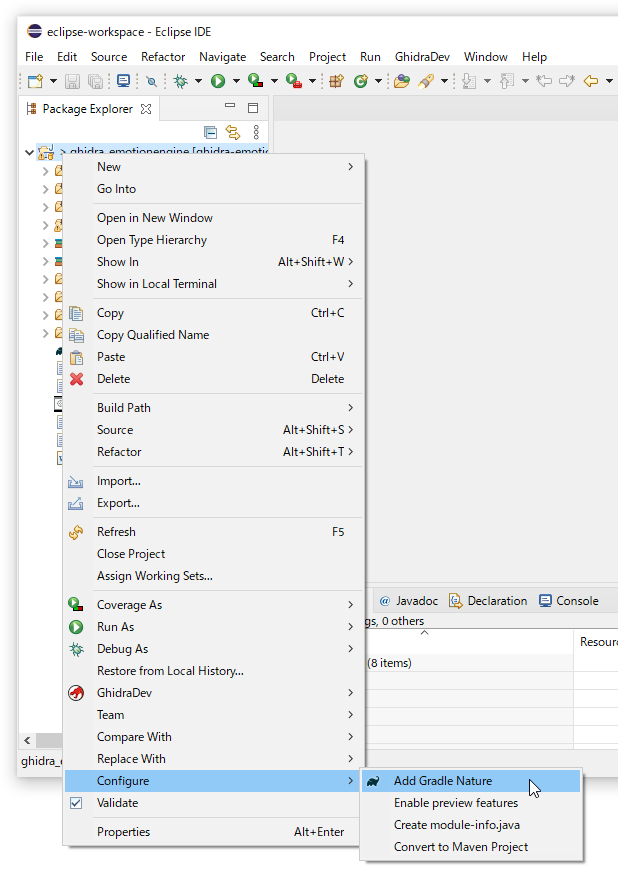

# Ghidra plus Eclipse <!-- omit in toc -->

TOC:

- [Deploy ghidra-emotionengine](#deploy-ghidra-emotionengine)
	- [Make ghidra-emotionengine an eclipse importable project](#make-ghidra-emotionengine-an-eclipse-importable-project)
- [Prepare Ghidra 9.1.2](#prepare-ghidra-912)
- [Install Eclipse](#install-eclipse)
- [Launch Eclipse](#launch-eclipse)
	- [Importing project](#importing-project)
	- [Install GhidraDev](#install-ghidradev)
	- [Java Build Path](#java-build-path)
	- [Link Ghidra](#link-ghidra)
	- [Launch Ghidra with extension loaded](#launch-ghidra-with-extension-loaded)
	- [Activate Gradle](#activate-gradle)
	- [Remove Gradle integration](#remove-gradle-integration)

# Deploy ghidra-emotionengine

If you want to use ghidra-emotionengine extension immediately, you can download it from releases:

- https://github.com/beardypig/ghidra-emotionengine/releases

If you want to use it with Eclipse, git clone:

- https://github.com/beardypig/ghidra-emotionengine

## Make ghidra-emotionengine an eclipse importable project

At least `.project` file is required to make it importable by Eclipse.

```xml
<?xml version="1.0" encoding="UTF-8"?>
<projectDescription>
	<name>ghidra_emotionengine</name>
	<comment></comment>
	<projects>
	</projects>
	<buildSpec>
		<buildCommand>
			<name>org.eclipse.jdt.core.javabuilder</name>
			<arguments>
			</arguments>
		</buildCommand>
	</buildSpec>
	<natures>
		<nature>org.eclipse.jdt.core.javanature</nature>
	</natures>
</projectDescription>
```

_Note:_ `.project` file can be saved by entering `".project"` on save file dialog.

# Prepare Ghidra 9.1.2

I recommend to use `Ghidra 9.1.2`, not `9.2.x`. But still you can use favorite version.

Download it from https://ghidra-sre.org/releaseNotes_9.2.1.html or somewhere.

I have installed to `H:\Dev\KH2\ghidra_9.1.2_PUBLIC`

# Install Eclipse

Install Eclipse from https://www.eclipse.org/downloads/

`Eclipse IDE for Java Delopvers` will be enough selection.


Install it somewhere.


Launch it.


Specify `Workspace` folder as you like.
The new one is always created if it does not exists.
I recommend to allocate one dedicated workspace for KH2 stuffs.


# Launch Eclipse

Close `Welcome`


## Importing project

Click `Import projects...`


`Existing Projects into Workspace`


Enter `Select root directory:` path to ghidra-emotionengine.


Press enter will recognize the project. Click `Finish`.


We are now back to Eclipse IDE.


## Install GhidraDev

See: https://ghidra-sre.org/InstallationGuide.html#GhidraExtensionNotes

Also see: `<GhidraInstallDir>/Extensions/Eclipse/GhidraDev/GhidraDev_README.html`

Select: `Help` → `Install New Software...`


Click `Manage...`


Click `Add...`


Click `Archive...` and select `GhidraDev-2.1.0.zip`. And `Add`.


Click `Apply and Close`.


Select added `GhidraDev-2.1.0.zip` from `Work with:` drop down.


Turn on `Ghidra` in list, and then `Next >`.


`Next >` again.


Accept and finish.


`Install anyway`


`Restart Now`


`Yes`


Now we have `GhidraDev` pull down menu.


## Java Build Path

Opening ghidra_emotionengine project in _Package Explorer_ will show some contents.


To shorten the steps, place `.classpath` file in root of project. It is same folder having `.project` file.

```xml
<?xml version="1.0" encoding="UTF-8"?>
<classpath>
	<classpathentry kind="src" path="src/main/java"/>
	<classpathentry kind="src" path="src/main/help"/>
	<classpathentry kind="src" path="src/main/resources"/>
	<classpathentry kind="src" path="ghidra_scripts"/>
	<classpathentry kind="output" path="bin"/>
</classpath>
```

Type `F5` will setup Java Build Path.


If you have plan change Java Build Path in GUI, right click `ghidra_emotionengine` project, and then click `Properties`.

Properties will open. Select `Java Build Path` tree item, and adjust as you like.


## Link Ghidra

Select `GhidraDev` → `Link Ghidra...`


`+`


`Add...`


Select `ghidra_9.1.2_PUBLIC` install dir.

`Apply and Close`


`Finish`


We get back to Eclipse IDE. And then all errors should be gone.


## Launch Ghidra with extension loaded

Click `Run As...`


`Ghidra` and `OK`


Your Ghidra will launch.


If you have already installed `ghidra-emotionengine` extension, collision error will be displayed.


- Disable `ghidra-emotionengine` extension while you use Ghidra on Eclipse.
- Enable it again if you launch Ghidra standalone.

## Activate Gradle

RClick project → `Configure` → `Add Gradle Nature`



RClick project → `Properties` → `Gradle` tree item

Add `-PGHIDRA_INSTALL_DIR=H:\Dev\KH2\ghidra_9.1.2_PUBLIC` or such to Program Arguments. `Apply and Close`


RClick project → `Gradle` → `Refresh Gradle Project`


If you have Gradle specific errors, you can select Gradle distribution:


## Remove Gradle integration

If you want to remove Gradle integration from project in some reasons, remove gradle things from `.project`. And then press `F5` at Eclipse.

```xml
<?xml version="1.0" encoding="UTF-8"?>
<projectDescription>
	<name>ghidra-kh2ai-gh</name>
	<comment></comment>
	<projects>
	</projects>
	<buildSpec>
		<buildCommand>
			<name>org.eclipse.jdt.core.javabuilder</name>
			<arguments>
			</arguments>
		</buildCommand>
	</buildSpec>
	<natures>
		<nature>org.eclipse.jdt.core.javanature</nature>
	</natures>
</projectDescription>
```
