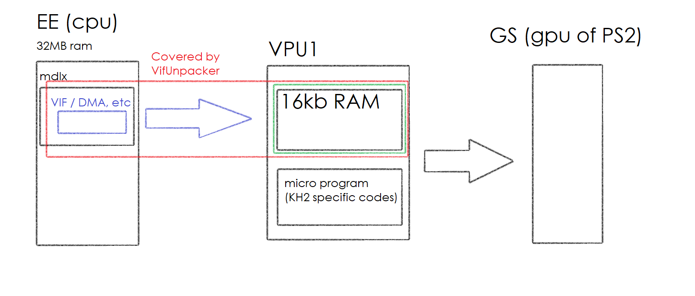

# Building mdlx model subpart DMAtags

## memo: working flow

There are Green part and Blue part.
The work of making mdlx mesh is almost to know Green part.
And then think about Blue part, how to transmit.


VifUnpacker of OpenKh covers the Red part. It will decode VIF / DMA tags.



VpuPacket.Read() of OpenKh will decode the composed data structre inside VPU1, without execution of micro program.


## memo: parsing

[vif.txt](vif.txt) and [mark0.png](mark0.png) are sample of parsing of VPU1 memory layout as a snapshot.
It assumes that it occurs after transmission of SKL_HEADER and its data block before execution of VPU1 micro program.
Useful to know entire memory layout.

The data starts from `00000400`.
The data before `00000400` is internal use of micro program.
VIF1_TOPS is set to `040`, and then the following data transmissions are offseted automatically.
We don't need to consider the fact of offseting by VIF1_TOPS register.
We can always assume that the destination top address is always `0`.

## memo: Kaitai Struct for mdlx and map

Here is a ksy file for decoding limited part of mdlx and map like this: [ksy.png](ksy.png).

https://gitlab.com/kenjiuno/khkh_xldM/-/blob/master/Parser/mdlx/bar-model-v2.ksy

Kaitai WebIDE: https://ide.kaitai.io/

This is an incomplete parser. Just use this to get idea to write a writer, study data placement or such.

## Summary

1. Load target model.
2. Split into sub models.
3. Split into sub model parts.
4. Build full VPU1 memory layout for target sub model part.
5. Compose single VIF packet which transfers header and blocks.
6. Compose DMAtags. Perform VIF packet and matrices transfer.

## Load target model

- `stripNode[]` (U, V, Index, Function)
- `vertexCoord[]` (X, Y, Z, W)
- `Matrix4x4[]` (64 bytes)

## Split into sub models

Split the mesh by:

- Texture

## Split into sub model parts

Split the model parts by memory usage like these values:

- stripNodeNum is 79, and matrixNum is 15 … `16*79 + 64*15 → 2224 bytes`
- stripNodeNum is 66, and matrixNum is 24 … `16*66 + 64*24 → 2592 bytes`

Normally each `vertexCoord` belongs to one or more `Matrix4x4`. It is called `weightGroup`.
Assume each `vertexCoord` belongs to one `Matrix4x4` in this time.

Group the `vertexCoord` by `Matrix4x4`. And then sort by bigger usage count.

```
matrix[0] has 20 vertexCoords to be transformed
matrix[1] has 17 vertexCoords to be transformed
matrix[2] has 14 vertexCoords to be transformed
...
```

The array of `20, 17, 14, ...` numbers are important. It is the `applyMatrixCount[]`.

## Build full VPU1 memory layout for target sub model part

1. Place header (64 bytes).
2. Place `stripNode[]` (u v vertexIdx flags)
3. Place `vertexCoord[]` (x y z factor)
4. Place `applyMatrixCount[]` (32-bit int array)
5. Place `weightGroupXCount[]` if `weightGroupNum ≧ 2`
6. Place `weightGroupX[]` if `weightGroupNum ≧ 2`
7. Reserve the `Matrix4x4[]` area

## Compose single VIF packet which transfers header and blocks

This is first part of VIF packet area from P_EX100.mdlx.

```
3B90h: 01 01 00 01 00 80 04 6C 01 00 00 00 00 00 00 00  .....€.l........ 
3BA0h: 00 00 00 00 00 00 00 00 4F 00 00 00 04 00 00 00  ........O....... 
3BB0h: 9F 00 00 00 A2 00 00 00 00 00 00 00 00 00 00 00  Ÿ...¢........... 
3BC0h: 00 00 00 00 00 00 00 00 4C 00 00 00 53 00 00 00  ........L...S... 
...
```

Each VIF command uses 4 bytes.

The mainly used commands are the following 5 commands.

- stcycl
- unpack
- stmask
- stcol
- nop

### Header

The header data is transferred in UNPACK V4-32.

```
0000   stcycl cl 01 wl 01
0004   unpack V4-32 c 4 a 000 usn 0 flg 1 m 0
    00000001 00000000 00000000 00000000 
    0000004f 00000004 0000009f 000000a2 
    00000000 00000000 00000000 00000000 
    0000004c 00000053 00000000 0000000a 
```

UNPACK V4-32 is useful to transfer the raw data block as-is. However UNPACK V4-32 consumes maximum data size compared to other formats.

```
00000400 01 00 00 00 00 00 00 00 00 00 00 00 00 00 00 00
00000410 4F 00 00 00 04 00 00 00 9F 00 00 00 A2 00 00 00
00000420 00 00 00 00 00 00 00 00 00 00 00 00 00 00 00 00
00000430 4C 00 00 00 53 00 00 00 00 00 00 00 0A 00 00 00
```

### UV of stripNode

UV of stripNode is transferred in UNPACK V2-16.

```
0048   stcycl cl 01 wl 01
004C   unpack V2-16 c 79 a 004 usn 0 flg 1 m 0
    0006 043b 
    0077 03f5 
    0192 043b 
    0110 037d 
```

The 2 cells are interpreted as XY and expanded into 32-bit XY.

```
00000440 06 00 00 00 3B 04 00 00 00 00 00 00 00 00 00 00
00000450 77 00 00 00 F5 03 00 00 00 00 00 00 00 00 00 00
00000460 92 01 00 00 3B 04 00 00 00 00 00 00 00 00 00 00
00000470 10 01 00 00 7D 03 00 00 00 00 00 00 00 00 00 00
```

### vertexIdx of stripNode

vertexIdx of stripNode is transferred in UNPACK S-8.

```
018C   stmask  3 3 0 3  3 3 0 3  3 3 0 3  3 3 0 3 
0194   stcycl cl 01 wl 01
0198   unpack S-8 c 79 a 004 usn 1 flg 1 m 1
    27 
    28 
    31 
    25 
```

Transfer vertexIdx as Z register location. Using STMASK to prevent already transferred data from rewriting.

```
00000440 06 00 00 00 3B 04 00 00 27 00 00 00 00 00 00 00
00000450 77 00 00 00 F5 03 00 00 28 00 00 00 00 00 00 00
00000460 92 01 00 00 3B 04 00 00 31 00 00 00 00 00 00 00
00000470 10 01 00 00 7D 03 00 00 25 00 00 00 00 00 00 00
```

### flags of stripNode

flags of stripNode is transferred in UNPACK S-8.

```
01EC   stmask  3 3 3 0  3 3 3 0  3 3 3 0  3 3 3 0 
01F4   stcycl cl 01 wl 01
01F8   unpack S-8 c 79 a 004 usn 1 flg 1 m 1
    10 
    10 
    20 
    30 
```

Transfer flags as W register location. Using STMASK to refrain rewrite of already written data.

```
00000440 06 00 00 00 3B 04 00 00 27 00 00 00 10 00 00 00
00000450 77 00 00 00 F5 03 00 00 28 00 00 00 10 00 00 00
00000460 92 01 00 00 3B 04 00 00 31 00 00 00 20 00 00 00
00000470 10 01 00 00 7D 03 00 00 25 00 00 00 30 00 00 00
```

### vertexCoord

This type of vertexCoord uses XYZ only, thus transferred with UNPACK V3-32.

In case of `weightGroupNum ≧ 2`, XYZW format is used instead. W is used for factor of vertex weight.

```
024C   stcol 3f800000 3f800000 3f800000 3f800000
0260   stmask  0 0 0 2  0 0 0 2  0 0 0 2  0 0 0 2 
0268   stcycl cl 01 wl 01
026C   unpack V3-32 c 76 a 053 usn 0 flg 1 m 1
    4138e7c0 c12b205e bfed2150 
    41457850 c0db7ca3 c0d94b88 
    40197180 c14cfc78 c0dde224 
    403b4c20 c1057044 c12ba777 
```

```
00000930 C0 E7 38 41 5E 20 2B C1 50 21 ED BF 00 00 00 00
00000940 50 78 45 41 A3 7C DB C0 88 4B D9 C0 00 00 00 00
00000950 80 71 19 40 78 FC 4C C1 24 E2 DD C0 00 00 00 00
00000960 20 4C 3B 40 44 70 05 C1 77 A7 2B C1 00 00 00 00
```

### applyMatrixCount

applyMatrixCount is transferred in UNPACK V4-32

```
0600   stcycl cl 01 wl 01
0604   unpack V4-32 c 3 a 09F usn 0 flg 1 m 0
    00000014 00000011 0000000e 0000000a 
    00000006 00000002 00000002 00000002 
    00000002 00000001 00000000 00000000 
```

```
00000DF0 14 00 00 00 11 00 00 00 0E 00 00 00 0A 00 00 00
00000E00 06 00 00 00 02 00 00 00 02 00 00 00 02 00 00 00
00000E10 02 00 00 00 01 00 00 00 00 00 00 00 00 00 00 00
```

## Compose DMAtags. Perform VIF packet and matrices transfer

This is first part of DMAtag area from P_EX100.mdlx.

The length (count of DMAtags) is written in model subpart. It is 460 (at 0x108 of mdlx) in this case.

```
DA20h: 64 00 00 30 C0 3A 00 00 00 00 00 00 00 00 00 00  d..0À:.......... 
DA30h: 04 00 00 30 35 00 00 00 01 01 00 01 A2 80 04 6C  ...05.......¢€.l 
DA40h: 04 00 00 30 02 00 00 00 01 01 00 01 A6 80 04 6C  ...0........¦€.l 
DA50h: 04 00 00 30 18 00 00 00 01 01 00 01 AA 80 04 6C  ...0........ª€.l 
DA60h: 04 00 00 30 29 00 00 00 01 01 00 01 AE 80 04 6C  ...0).......®€.l 
DA70h: 04 00 00 30 0C 00 00 00 01 01 00 01 B2 80 04 6C  ...0........²€.l 
DA80h: 04 00 00 30 31 00 00 00 01 01 00 01 B6 80 04 6C  ...01.......¶€.l 
DA90h: 04 00 00 30 3F 00 00 00 01 01 00 01 BA 80 04 6C  ...0?.......º€.l 
DAA0h: 04 00 00 30 14 00 00 00 01 01 00 01 BE 80 04 6C  ...0........¾€.l 
DAB0h: 04 00 00 30 22 00 00 00 01 01 00 01 C2 80 04 6C  ...0".......€.l 
DAC0h: 04 00 00 30 16 00 00 00 01 01 00 01 C6 80 04 6C  ...0........Æ€.l 
DAD0h: 00 00 00 10 00 00 00 00 00 00 00 17 00 00 00 00  ................ 
```

At DA20h

- It is a SourceChainDmaTag (id=REF).
- `C0 3A` points the body of VIF packet at `0x3B90` stored in mdlx.
- It transfers SKL_HEADER and its data block into VPU1.

```
3B90h: 01 01 00 01 00 80 04 6C 01 00 00 00 00 00 00 00  .....€.l........ 
3BA0h: 00 00 00 00 00 00 00 00 4F 00 00 00 04 00 00 00  ........O....... 
3BB0h: 9F 00 00 00 A2 00 00 00 00 00 00 00 00 00 00 00  Ÿ...¢........... 
3BC0h: 00 00 00 00 00 00 00 00 4C 00 00 00 53 00 00 00  ........L...S... 
...
```

From DA30h to DAC0h

- They are SourceChainDmaTags (id=REF).
- They transfer matrices one by one, because source matrix index is not contiguous.
- The address part (`35 00`, `02 00`, ...) points index of matrix, instead of actual source memory address. But this index is not used and may be simple mark for human debugging.
- The actual index array is stored in `indicesOfBone` (0xf6e0 ~ 0xfda7).

At DAD0h

- It is SourceChainDmaTag (id=CNT).
- It contains 2 (MSCNT and NOP) VIF commands.
- MSCNT command allow VPU1 to process the input data, and CPU will await until VPU1 processing finishes.
- This is a terminator of set of DMAtags.
- Starting from DAE0h, new transmission of SKL_HEADER and its data will start, as well.
